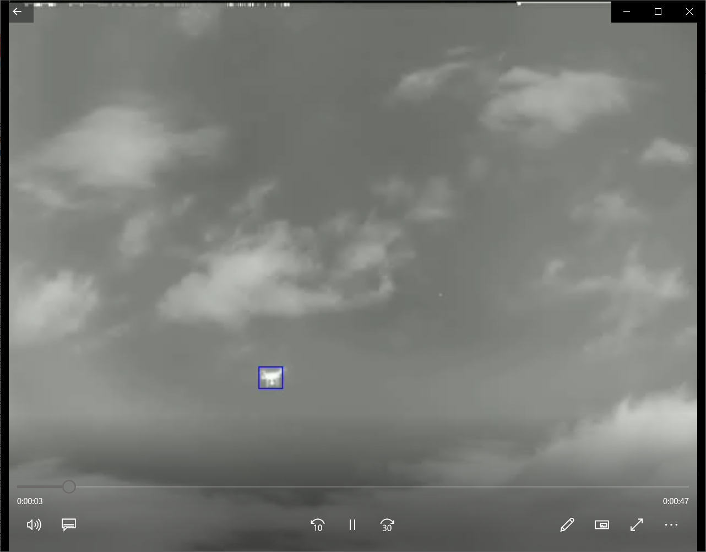
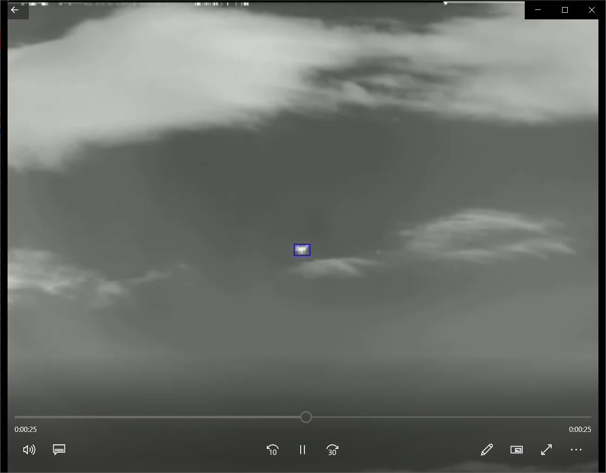
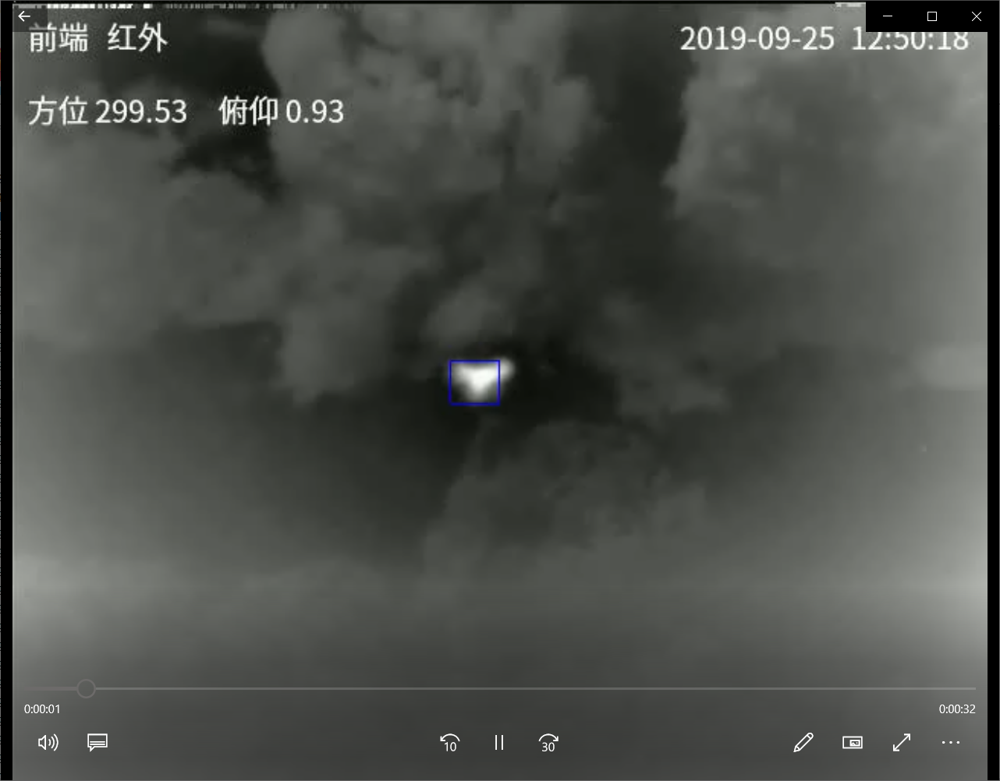

# UAV Track

Use [AGPCNet]https://github.com/Tianfang-Zhang/AGPCNet

## Datasets

Use UAV Datasets

## Usage
### Train
Unzip UAV Datasets to dir "original_data". Then do
```
python to_dataset.py
python train.py --net-name agpcnet_1 --batch-size 8 --save-iter-step 40 --dataset sirstaug
```

### Validation
Do
```
python cal_acc.py
```
to get accuracy of each video.

Do
```
python track.py
```
to get text results of test videos.

Do
```
python track.py
```
to get video results of test videos.

### Results






